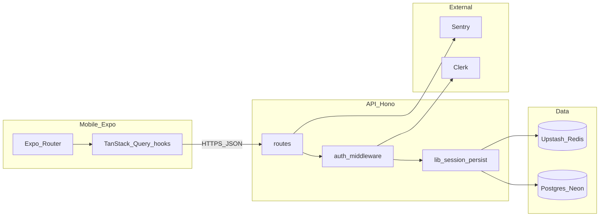
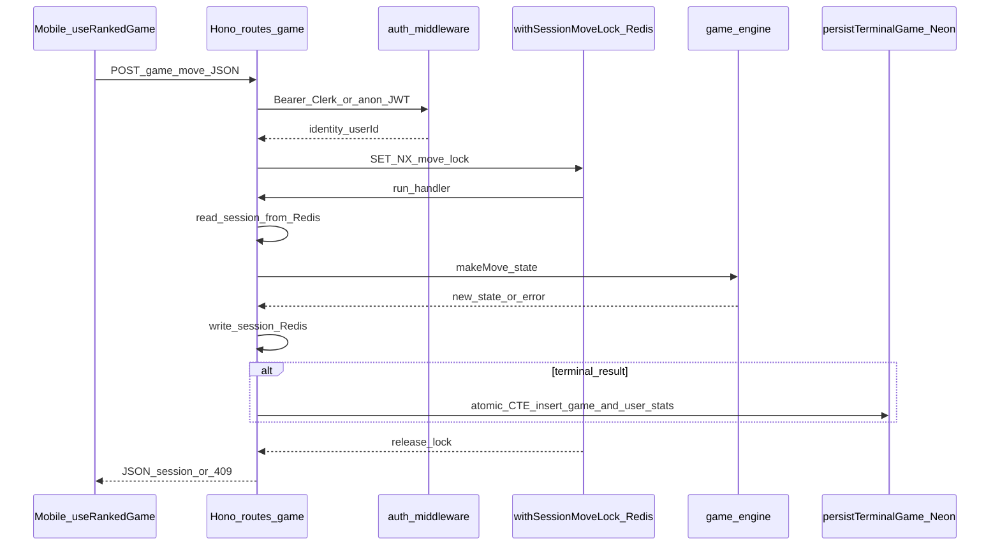

# Architecture

High-level design of **Cheddr Tic-Tac-Toe**: mobile ↔ API ↔ data stores, plus why key choices were made.

## System context

## Ranked move lifecycle (`POST /game/move`)

- **Lock**: Per-session Redis lock avoids concurrent moves corrupting session JSON or double-persisting. See `withSessionMoveLock` in [`apps/api/src/lib/session.ts`](apps/api/src/lib/session.ts).
- **Engine**: All legality and AI moves run in `@cheddr/game-engine` with no DB/HTTP imports — easy to test and reuse.

## Anonymous → Clerk

1. Mobile mints anon JWT via `POST /auth/anon` (rate-limited, device binding in Redis).
2. After Clerk sign-in, mobile calls merge/sync endpoints with Clerk session + prior anon id (see [`apps/api/src/lib/syncAnon.ts`](apps/api/src/lib/syncAnon.ts) and user routes).
3. Server reassigns rows and invalidates anon session as documented in code paths.

## Why the game engine is pure

[`packages/game-engine`](packages/game-engine) exposes **functions over immutable-ish state** (`makeMove`, `checkResult`, AI). Benefits:

- Unit + **property tests** (`fast-check`) without mocks.
- Same logic could drive a future web client or offline bot.
- API stays a thin orchestration layer: validate → load session → call engine → persist.

## Neon HTTP driver and persistence

Production uses **Neon serverless HTTP** for Drizzle. That driver does **not** support interactive multi-statement transactions the way a single `BEGIN … COMMIT` over one connection does.

**Ranked terminal games** (`persistTerminalGame`): the `INSERT` into `games` and the `UPDATE` of ranked counters on `users` run as a **single Postgres statement** (CTE), so they commit atomically without `db.transaction` (which the Neon HTTP driver rejects).

**Anonymous → Clerk merge** (`syncAnonToClerk`): still **sequential statements** with documented partial-failure semantics; reassignment of `games.user_id` is idempotent on retry, and the user-row update is a full overwrite. A future improvement is a PL/pgSQL function if we need stricter atomicity there.

**Drift repair**: ranked aggregate columns on `users` can still diverge from `games` due to legacy partial writes or manual DB edits. Run `pnpm --filter @cheddr/api reconcile:stats` (see [`apps/api/src/scripts/reconcileUserStats.ts`](apps/api/src/scripts/reconcileUserStats.ts)) to recompute `games_played` / wins / losses / draws from ranked `games` rows only; **`elo` is intentionally not changed** (path-dependent ELO + anti-farming clamps). Use `--dry-run` to log mismatches without writing; exit code `1` when drift is found in dry-run (cron-friendly).

## Shared contracts

[`packages/api-types`](packages/api-types) defines **Zod** schemas; the API validates with `@hono/zod-validator`. Types are inferred from schemas to keep mobile and API aligned (mobile should validate responses where critical).

## Further reading

- CI/CD and migration gating: [`docs/ci.md`](docs/ci.md)
- Agent / Cursor rules: [`AGENTS.md`](AGENTS.md)
